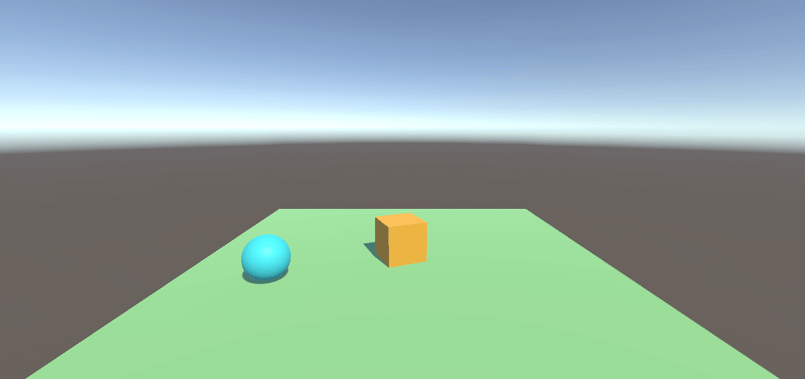

# Interfaces Inteligentes: Movimientos
## Ejercicio 1
```cs
public float speed = 5f;
```
La `velocidad` es un atributo público de la clase para que se pueda modificar desde el inspector

```cs
void Update()
{
    float horizontal = Input.GetAxis("Horizontal");
    float vertical = Input.GetAxis("Vertical");

    Vector3 movement = new Vector3(horizontal, 0, vertical) * speed * Time.deltaTime;
    transform.Translate(movement);

    if (Input.GetKey(KeyCode.UpArrow))
    {
        Debug.Log(keyCode + (speed * vertical));
    }
    else if (Input.GetKey(KeyCode.DownArrow))
    {
        Debug.Log(keyCode + (speed * vertical));
    }
    else if (Input.GetKey(KeyCode.LeftArrow))
    {
        Debug.Log(keyCode + (speed * horizontal));
    }
    else if (Input.GetKey(KeyCode.RightArrow))
    {
        Debug.Log(keyCode + (speed * horizontal));
    }
}
```
1. 


## Ejercicio 2
Antes de nada, se debe asignar la `tecla H` al comando `Shoot` (Disparo). Para ello vamos a `Edit > proyect Settings > Input Manager > Axes` y allí creamos uno nuevo y ponemos la siguiente información:


```cs
public GameObject bulletPrefab;
public float bulletSpeed = 10f;
public Transform shootingPoint;
```
1. En el propio editor se creó un `prefab` de una bala (una esfera). Este script recibe este objeto como parámetro. Se puede arrastrar desde el inspector
2. `bulletSpeed` es la velocidad a la que saldrá disparada la bala. Se puede modificar desde el inspector
3. Y el `shootingPoint` es un objeto vacío colocado enfrente del cubo que actuará como `punto de salida para la bala`. Se asigna desde el inspector

```cs
void Update()
{
    if (Input.GetButtonDown("Shoot"))
    {
        Debug.Log("Disparo realizado");
        ExecuteShot();
    }
}
```
Si la tecla pulsada se corresponde al del comando `Shoot (H)`, muestra por consola que se ha realizado el disparo y llama a la función que lo ejecuta

```cs
void ExecuteShot()
{
    GameObject bullet = Instantiate(bulletPrefab, shootingPoint.position, shootingPoint.rotation);

    Rigidbody rb = bullet.GetComponent<Rigidbody>();
    if (rb != null)
    {
        rb.velocity = shootingPoint.forward * bulletSpeed;
    }
    Debug.Log("Shot!");
}
```


## Ejercicio 3
```cs
    public Vector3 moveDirection = new Vector3(1, 0, 0);
    public float speed = 2f;
```
- `moveDirection` es el vector que indica la dirección del movimiento. Se puede modificar desde el inspector. Inicialmete a (1, 0, 0)
- `speed` determina la velocidad a la que se mueve el cubo. Inicialmente igual a 2

```cs
    void Start()
    {
        transform.position = new Vector3(transform.position.x, 0, transform.position.z);
    }
```
Simplemente se establece la posición inicial del cubo con el `eje y = 0`

```cs
    void Update()
    {
        transform.Translate(moveDirection.x * speed * Time.deltaTime, moveDirection.y * speed * Time.deltaTime, moveDirection.z * speed * Time.deltaTime);
    }
```
Mueve el cubo en cada frame en la dirección especificada (`moveDirection`) multiplicada por 'speed'. Se usa `Time.deltaTime` para asegurar que el movimiento sea suave e independiente de la velocidad de los fotogramas


### Resultado 1
- **moveDirection** = (2, 0, 0)
- **speed** = 2
- **Posición cubo** = (0, 0, 0)

El cubo se moverá el doble de rápido en la misma dirección especificada originalmente. Avanzará el doble de la distancia por cada frame porque las coordenadas de la dirección son ahora mayores


### Resultado 2
- **moveDirection** = (1, 0, 0)
- **speed** = 4
- **Posición cubo** = (0, 0, 0)

El cubo se moverá más rápido, cubriendo más distancia por frame. La dirección no cambia


### Resultado 3
- **moveDirection** = (1, 0, 0)
- **speed** = 0.5
- **Posición cubo** = (0, 0, 0)

El cubo se moverá más lento, avanzando menos distancia por frame


### Resultado 4
- **moveDirection** = (1, 0, 0)
- **speed** = 2
- **Posición cubo** = (0, 1, 0)

El cubo se moverá en la dirección establecida, simpemente a una mayor altura


### Resultado 5
```cs
```
- **Sistema de referencia local:** Por defecto, `transform.Translate()` usa el sistema de referencia local del objeto, por lo que el cubo se seguirá moviendo en la misma dirección que en las pruebas anteriores


```cs
transform.Translate(moveDirection.x * speed * Time.deltaTime, moveDirection.y * speed * Time.deltaTime, moveDirection.z * speed * Time.deltaTime. Space.World);
```
- Ahora el cubo se moverá usando el sistema de coordenadas del propio mundo y no el suyo propio (local). Para esta prueba se rotó el cubo para que sus ejes no fueran iguales y se pudiera ver la diferencia. En este caso, el cubo va hacia el lado contrario.


## Ejercicio 4
```cs
    public float speed = 5f;
    public GameObject cube;
    public GameObject sphere;
```
- `speed` es la velocidad el objeto
- `cube` y `sphere` son referencias a los objetos correspondientes

```cs
    void Update()
    {
        InputMoveCube();
        InputMoveSphere();
    }
```
Simplemente llama a las funciones que mueve a cada objeto con sus respectivas teclas

```cs
    void InputMoveCube()
    {
        if (Input.GetKey(KeyCode.UpArrow))
        {
            cube.transform.Translate(Vector3.forward * speed);
        }
        else if (Input.GetKey(KeyCode.DownArrow))
        {
            cube.transform.Translate(Vector3.back * speed);
        }
        else if (Input.GetKey(KeyCode.LeftArrow))
        {
            cube.transform.Translate(Vector3.left * speed);
        }
        else if (Input.GetKey(KeyCode.RightArrow))
        {
            cube.transform.Translate(Vector3.right * speed);
        }
        
    }
```
Si el input es la `tecla flecha`, el cubo se moverá en su correspondiente dirección gracias a la función `Translate`

```cs
    void InputMoveSphere()
    {
        if (Input.GetKey(KeyCode.W))
        {
            sphere.transform.Translate(Vector3.forward * speed);
        }
        else if (Input.GetKey(KeyCode.S))
        {
            sphere.transform.Translate(Vector3.back * speed);
        }
        else if (Input.GetKey(KeyCode.A))
        {
            sphere.transform.Translate(Vector3.left * speed);
        }
        else if (Input.GetKey(KeyCode.D))
        {
            sphere.transform.Translate(Vector3.right * speed);
        }
    }
```
Si el input es `w`, `a`, `s`, `d`, el cubo se moverá en su correspondiente dirección (arriba, izquierda, abajo, derecha respectivamente) gracias a la función `Translate`

***Nota:*** Como no se usa `Time.deltaTime`, los movimientos se ven bruscos y salteados


## Ejercicio 5
Primero hay que asignar:
- **Horizontal:** `Flechas izquierda y derecha` (eliminamos de teclas alternativas la `A` y `D`)
- **Vertical:** `Flechas arriba y abajo` (eliminamos de teclas alternativas la `W` y `S`)
- **HorizontalSphere:** `A` y `D`
- **VerticalSphere:** `W` y `S`
  
```cs
    public float speed = 5f;
    public GameObject cube;
    public GameObject sphere;
```
- `speed` es la velocidad el objeto
- `cube` y `sphere` son referencias a los objetos correspondientes

```cs
    void Update()
    {
        MoveCube();
        MoveSphere();
    }
```
Simplemente llama a las funciones que mueve a cada objeto con sus respectivas teclas

```cs
    void MoveCube()
    {
        float horizontal = Input.GetAxis("Horizontal");
        float vertical = Input.GetAxis("Vertical");

        Vector3 moveDirection = new Vector3(horizontal, 0, vertical);
        cube.transform.Translate(moveDirection * speed * Time.deltaTime, Space.World);
    }

    void MoveSphere()
    {
        float horizontal = Input.GetAxis("HorizontalSphere");
        float vertical = Input.GetAxis("VerticalSphere");

        Vector3 moveDirection = new Vector3(horizontal, 0, vertical);
        sphere.transform.Translate(moveDirection * speed * Time.deltaTime, Space.World);
    }
```

1. Se obtienen los valores de movimiento del usuario con `Input.GetAxis()`
2. Se crea un vector de dirección con `y = 0`
3. Con `Translate()` se mueve el objeto correspondiente. `Time.deltaTime` permite que el movimiento sea uniforme sin importar los frames por segundo
   


## Ejercicio 6
***Nota:*** Los atributos de la clase son los mismos que los del **ejercicio 5**

```cs
    void Update()
    {
        MoveCubeTowardsSphere();
        MoveSphere();
    }
```
Simplemente llama a las funciones que mueve a cada objeto con sus respectivas teclas

```cs
    void MoveCubeTowardsSphere()
    {
        Vector3 direction = sphere.transform.position - cube.transform.position;
        direction.y = 0;

        Vector3 moveDirection = direction.normalized;

        cube.transform.Translate(moveDirection * (speed - 2) * Time.deltaTime, Space.World);
    }
```
1. Se calcula la dirección hacia la que el cubo debe moverse. Al restar la posición del `cubo` de la posición de la `esfera`, obtienes un vector que apunta desde el cubo hacia la esfera
2. se establece `y = 0` para evitar cualquier movimiento vertical
3. Se normaliza el vector de dirección para que tenga `magnitud 1`, permitiendo mover el cubo en esa dirección sin importar la distancia real
4. Con `Translate()` se mueve el cubo a una velocidad de `speed - 2` para que este siempre vaya más lento que la esfera


## Ejercicio 7
***Nota:*** Los atributos de la clase son los mismos que los del **ejercicio 5**

```cs
    void Update()
    {
        MoveAndRotateTowardSphere();
        MoveSphere();
    }
```
Simplemente llama a las funciones que mueve a cada objeto con sus respectivas teclas

```cs
    void MoveAndRotateTowardSphere()
    {
        cube.transform.LookAt(sphere.transform);
        cube.transform.Translate(Vector3.forward * (speed - 2) * Time.deltaTime);
    }
```
1. Primero se hace que el cubo gire para mirar hacia la dirección de la `esfera`, alineando su frente (el eje Z local del cubo) hacia la posición de la esfera
2. Se mueve el cubo en su propio sistema de coordenadas locales (hacia su frente) usando `Vector3.forward`
   


## Ejercicio 8
```cs
    public float speed = 5f;
    public float rotationSpeed = 100f;
```
- La velocidad de movimiento
- La velocidad de rotación

```cs
    void Update()
    {
        float horizontal = Input.GetAxis("Horizontal");
        transform.Rotate(0, horizontal * rotationSpeed * Time.deltaTime, 0);

        transform.Translate(transform.forward * speed * Time.deltaTime, Space.World);

        Debug.DrawRay(transform.position, transform.forward * 5, Color.red);
    }
```
1. Se obtiene el valor de entrada del usuario para el `eje horizontal`
2. El objeto gira entorno a su `eje y`, por lo que solo puede girar hacia los lados
3. Se mueve el objeto con `Translate()` sobre el eje de coordenadas del mundo
4. Con `Debug.DrawRay()` se dibuja una línea en la escena (que solo se puede ver desde el editor) desde la posición del objeto hacia delante. Ayuda a visualizar la dirección en la mira y se mueve el objeto


## Ejercicio 9
## Ejercicio 10
## Ejercicio 11
## Ejercicio 12
